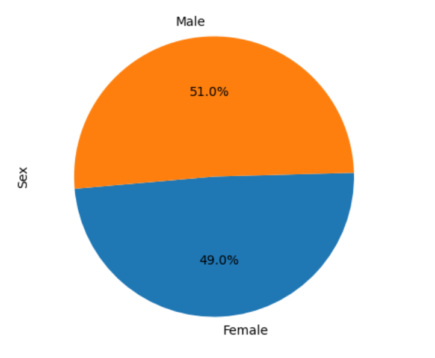
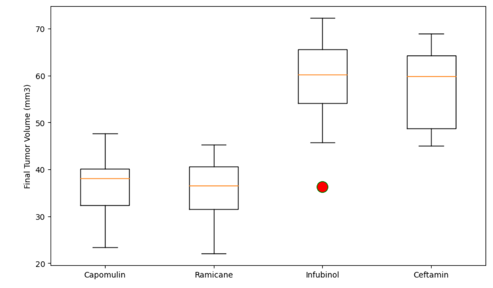
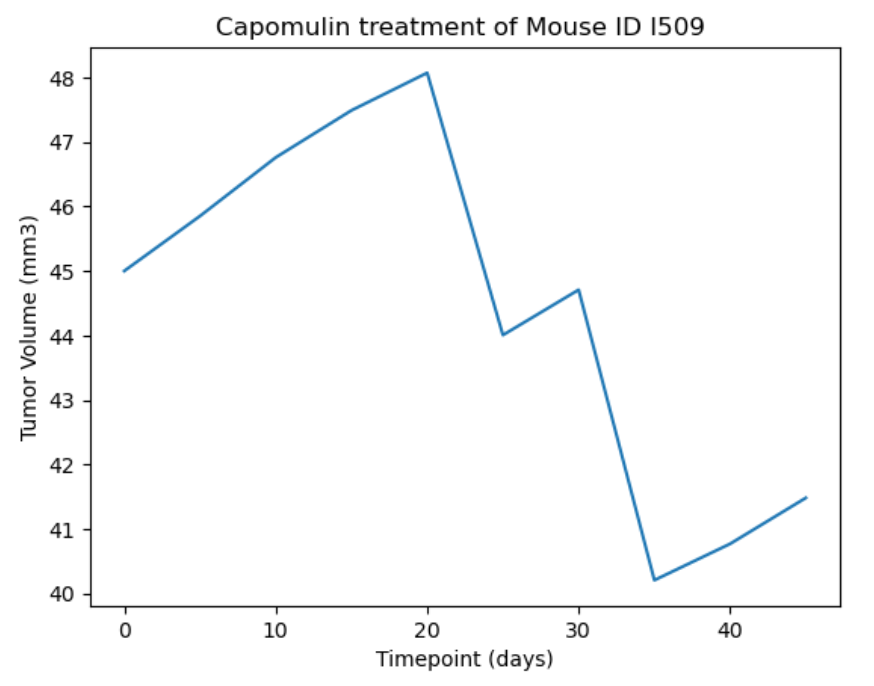
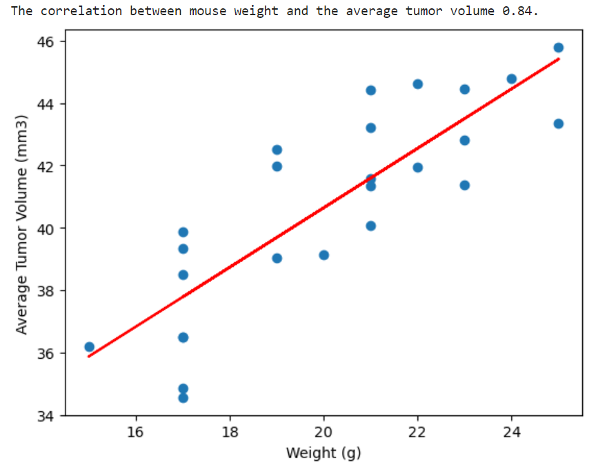

# Pymaceuticals Analysis - Executive Overview

This project involves the analysis of pharmaceutical data from a time-interval screening with antineoplastic medications for squamous cell carcinoma in laboratory mice. The trials lasted for 45 days, and the study examined the effects of different treatment regimens on tumor size and other metrics. The primary focus was on the drug regimens Capomulin, Ramicane, Infubinol, and Ceftamin.

## Key Findings

### Sample Overview

The study included 248 mice, consisting of 51.0% males and 49.0% females. The average age of the mice was 12.7762085 months, which corresponds to approximately 43.20 years in humans. It is worth noting that 45 days of antineoplastic treatment in mice is equivalent to approximately 5 years of treatment in humans.

### Tumor Size

Ramicane had the smallest tumor size, with an average volume of 22.05mm³. The average tumor volume for Ramicane was 40.21mm³, slightly smaller than the average volume for Capomulin (40.67mm³). In contrast, Ketapril had the highest tumor volume at 78.56mm³, which was 30.41mm³ higher than Capomulin. The difference between Ketapril and Capomulin in terms of average tumor volume was 14.55mm³, and the difference in the smallest tumors produced by the two drugs was 21.66mm³.

### Drug Comparison

The distribution of results for Capomulin and Ramicane showed a similar pattern, with almost parallel distributions. However, an outlier was observed in the Infubinol trials, where one subject had a tumor size of 36.32mm³ while the remaining subjects had tumor sizes above 45mm³ and below 80mm³.

### Treatment Progress

An individual mouse (Mouse ID l509) treated with Capomulin demonstrated a consistent growth in tumor size for about half of the trial duration. However, during the latter half of the treatment, a decrease in tumor size of approximately 20% was observed, highlighting the effectiveness of Capomulin.

### Correlation

There was a strong positive correlation of 0.84 between mouse weight and average tumor volume, suggesting that as the mouse weight increased, so did the tumor volume.

By conducting this analysis, valuable insights were obtained regarding the effectiveness of different drug regimens in treating tumors in laboratory mice. The findings can contribute to informed decision-making in the field of cancer research and the development of potential treatment options.
